# Rencana Implementasi Temporal & NATS (Hybrid Saga Pattern)

Dokumen ini berisi rencana implementasi untuk menangani distributed transactions secara aman dan *loosely coupled* menggunakan **Temporal** (untuk durabilitas transaksi lokal) dan **NATS JetStream** (untuk komunikasi antar-service).

---

## Arsitektur Sistem (Choreographed Orchestrators)

Setiap microservice memiliki **local Temporal workflow** sendiri untuk menjamin ketahanan transaksi di databasenya masing-masing. Komunikasi antar-service dijalankan secara asinkron menggunakan **NATS JetStream**.

```mermaid
sequenceDiagram
    autonumber
    actor Client
    participant Gateway
    participant AcademyService
    participant NATS
    participant IdentityService

    Client->>Gateway: POST /academies (Daftar Academy)
    Gateway->>AcademyService: gRPC RegisterAcademy
    Note over AcademyService: Menjalankan Local Workflow:<br/>RegisterAcademyWorkflow
    AcademyService->>NATS: Publish "academy.created"
    AcademyService-->>Gateway: Response Success (Pending)
    Gateway-->>Client: HTTP 202 Accepted
    
    NATS->>IdentityService: Consume "academy.created"
    Note over IdentityService: Menjalankan Local Workflow:<br/>CreateAdminWorkflow
    alt Sukses
        Note over IdentityService: Admin dibuat &<br/>Kirim Email Selamat Datang
    else Gagal (e.g. Email Duplikat)
        IdentityService->>NATS: Publish "academy.registration.failed"
        NATS->>AcademyService: Consume "academy.registration.failed"
        Note over AcademyService: Menjalankan Local Rollback:<br/>Hapus Academy yang Pending
    end
```



---

## 📋 Langkah-Langkah Implementasi

### Tahap 1: Setup Infrastruktur
1. Tambahkan service **Temporal** ke Podman/Docker compose lokal atau jalankan secara terpisah.
   - Gunakan PostgreSQL yang sudah ada sebagai persistence layer Temporal.
2. Pastikan port OTel (OpenTelemetry) terhubung ke Temporal agar kita bisa memonitor trace workflow di Jaeger UI.

### Tahap 2: Setup SDK di `shared` Module
1. Tambahkan inisialisasi client Temporal helper di folder `shared/infrastructure/temporal/client.go` agar bisa digunakan kembali oleh semua service.
2. Definisikan helper untuk menghubungkan context tracing OpenTelemetry antara Temporal dan Go context.

### Tahap 3: Implementasi di Academy Service (Orchestrator Pertama)
1. **Definisikan Activities:**
   - `SavePendingAcademyActivity`: Menyimpan data academy ke DB dengan status `PENDING`.
   - `PublishNatsCreatedEventActivity`: Mengirimkan message `academy.created` ke NATS JetStream.
   - `RollbackAcademyActivity`: Menghapus/mengubah status academy menjadi `FAILED` jika transaksi global batal.
2. **Definisikan Workflow:**
   - `RegisterAcademyWorkflow` untuk mengatur urutan eksekusi activity di atas.
3. **Setup Worker:**
   - Jalankan Temporal Worker di dalam goroutine saat startup `main.go`.

### Tahap 4: Implementasi di Identity Service (Orchestrator Kedua)
1. **Buat NATS Subscriber Listener:**
   - Saat menerima event `academy.created`, panggil Temporal Client untuk men-trigger `CreateAdminWorkflow`.
2. **Definisikan Activities:**
   - `CreateAdminUserActivity`: Menyimpan user admin baru ke DB.
   - `SendWelcomeEmailActivity`: Mengirimkan email verifikasi.
   - `PublishNatsFailedEventActivity`: Mengirimkan message `academy.registration.failed` jika proses pembuatan user gagal.
3. **Definisikan Workflow:**
   - `CreateAdminWorkflow` untuk mengeksekusi aktivitas pembuatan admin.

---

## 💻 Contoh Struktur Kode (Go SDK)

### 1. Workflow Lokal di Academy Service
```go
package workflow

import (
	"time"
	"go.temporal.io/sdk/workflow"
)

func RegisterAcademyWorkflow(ctx workflow.Context, req AcademyRequest) error {
	options := workflow.ActivityOptions{
		StartToCloseTimeout: 10 * time.Second,
	}
	ctx = workflow.WithActivityOptions(ctx, options)

	// Step 1: Simpan data awal di database (status pending)
	err := workflow.ExecuteActivity(ctx, SavePendingAcademyActivity, req).Get(ctx, nil)
	if err != nil {
		return err
	}

	// Step 2: Kirim event ke NATS untuk dilanjutkan oleh Identity Service
	err = workflow.ExecuteActivity(ctx, PublishNatsCreatedEventActivity, req).Get(ctx, nil)
	if err != nil {
		// Jika NATS gagal, lakukan rollback lokal instan
		_ = workflow.ExecuteActivity(ctx, RollbackAcademyActivity, req.ID).Get(ctx, nil)
		return err
	}

	return nil
}
```

### 2. NATS Listener di Identity Service yang memicu Workflow Baru
```go
func (s *IdentitySubscriber) HandleAcademyCreated(ctx context.Context, msg *nats.Msg) {
	var event AcademyCreatedEvent
	if err := json.Unmarshal(msg.Data, &event); err != nil {
		return
	}

	options := client.StartWorkflowOptions{
		ID:        "create-admin-" + event.AcademyID,
		TaskQueue: "identity-task-queue",
	}

	// Memicu workflow lokal baru di Identity Service
	_, err := s.temporalClient.ExecuteWorkflow(ctx, options, CreateAdminWorkflow, event)
	if err != nil {
		s.logger.Error("failed to start admin workflow", zap.Error(err))
	}
}
```
